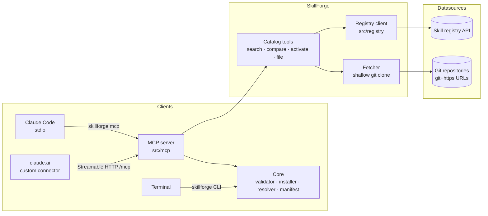

# Architecture

## The two install paths

| Surface | Mechanism | Persistence |
|---|---|---|
| Claude Code (stdio) | `skillforge_install` writes the skill to disk (`~/.skillforge/…` or `<project>/.skillforge/`) | Permanent |
| claude.ai (remote) | `skillforge_activate` returns the full SKILL.md; Claude follows it verbatim in-context (virtual install). For a permanent install Claude recreates the skill in the claude.ai skill panel and the user clicks "Copy to your skills". | Conversation / account |

Skills are additionally exposed as MCP resources under `skill://<name>/SKILL.md`
plus `skill://index.json` (SEP-2640) for clients that support skills-over-MCP.
